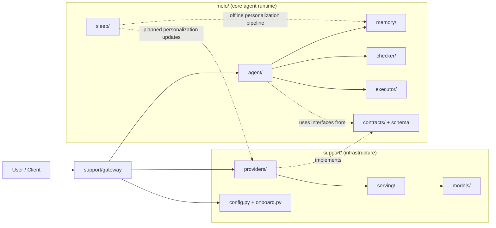
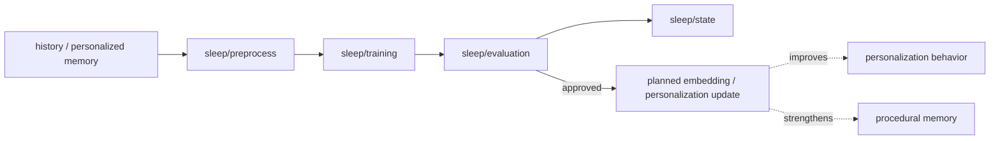

# localmelo

[English](./README.md) | [简体中文](./README.zh-CN.md)

`localmelo` is a local-first agent runtime focused on explicit memory layers,
tool use, and a future sleep-time personalization workflow.

The project is being built in public. The architecture is in place, the codebase
is being organized, and core interfaces are being stabilized, but the full
product vision is not implemented yet.

## Status

**Pre-alpha / work in progress**

This repository should currently be read as:

- an evolving agent runtime
- a clean project structure for future development
- a foundation for local deployment, memory, and personalization experiments

It should **not** yet be treated as:

- a production-ready agent framework
- a stable public API
- a finished personalization or memory system

Expect breaking changes while the project is being shaped.

## Vision

The long-term goal of `localmelo` is to provide a local agent stack with:

- a core runtime separated from deployment and infrastructure concerns
- multiple memory layers with different responsibilities
- explicit support for local model backends
- a sleep-time pipeline for future personalization and offline consolidation

The intended model is:

- `working memory` for active session context
- `long memory` for slower, selective retrieval
- `history` for append-only records
- `personalized memory` for future training signals
- `sleep mode` for preprocessing, training, evaluation, and state tracking

## Current Scope

What exists today:

- a split architecture between `melo/` and `support/`
- agent, memory, checker, and executor modules
- provider contracts and OpenAI-compatible provider implementations
- gateway and serving infrastructure
- persistent config and local serving helpers
- scaffolding for sleep-time preprocessing, training, evaluation, and state
- test coverage around the current architecture and integration points

What is intentionally still incomplete:

- a complete end-to-end sleep mode workflow
- a finished personalization training pipeline
- stable long-memory promotion and retrieval policies
- production-grade developer documentation and examples
- finalized external APIs

## Architecture

The repository is organized around a strict separation of concerns:

```text
localmelo/
  melo/       # core runtime: agent, memory, checker, executor, sleep
  support/    # infrastructure: providers, gateway, serving, config, models
  tests/      # regression and integration tests
```

Design rule:

- `melo/` is the main agent layer
- `support/` is the infrastructure layer that supports the agent
- `melo/` should not depend on `support/` implementations directly

### High-Level Architecture



### Structure Overview

#### `melo/`

`melo/` contains the core agent runtime itself.

Its main submodules are:

- `agent/`: the main agent loop, chat planning, and high-level orchestration
- `memory/`: memory coordination across working memory, long memory, history,
  tool-related memory, and future personalized memory flows
- `checker/`: validation and safety boundaries between planning, execution,
  gateway ingress, and memory writes
- `executor/`: tool execution, built-in tools, execution models, and workspace
  policy
- `sleep/`: the offline personalization pipeline, intended for preprocessing,
  training, evaluation, and state tracking during user idle periods
- `contracts/`: shared runtime interfaces such as provider contracts
- `schema.py`: shared runtime data structures and core types

#### `support/`

`support/` contains the infrastructure needed to run the agent, but is not the
agent runtime itself.

It currently includes:

- `providers/`: concrete LLM and embedding provider implementations
- `gateway/`: session management, HTTP gateway, and webapp wiring
- `serving/`: local model serving helpers and serving configuration
- `models/`: local model registry, compile helpers, and compiled model paths
- `config.py`: persistent runtime configuration
- `onboard.py`: setup and onboarding flow
- `3rdparty/`: vendored third-party dependencies needed by the support layer

### Sleep Module Flow



## Getting Started

### Requirements

- Python 3.11+

### Install

```bash
pip install -e ".[dev,gateway]"
```

### Run

Direct mode:

```bash
melo "hello"
```

Gateway mode:

```bash
melo --serve
```

### Test

```bash
pytest
```

## Development Notes

The project is currently architecture-first.

That means the priority right now is:

- cleaning boundaries between runtime and infrastructure
- stabilizing contracts and internal data flow
- building the memory and sleep-mode foundations
- improving test coverage before feature expansion

If you are reading this early, the repository may look "more organized than
feature-complete" on purpose.

## Roadmap

Near-term:

- finish the first usable local agent loop
- expand memory-layer behavior beyond scaffolding
- wire sleep-mode preprocessing into actual runtime flows
- improve local serving and backend configuration UX

Mid-term:

- add real sleep-time dataset preparation
- add adapter-based personalization experiments
- define a clearer long-memory retrieval and promotion policy
- add examples and documentation for local deployment

Long-term:

- support stable local-first agent workflows
- support explicit memory consolidation
- support optional user-specific personalization during offline periods

## Updates

This section is meant to make progress easy to track while the project is still
forming.

### Latest update

- runtime and infrastructure were split into `melo/` and `support/`
- provider contracts were introduced to reduce coupling
- memory and sleep-mode package boundaries were established
- the `sleep` module was added as the foundation for continuous personalization
  work, with the long-term goal of incrementally fine-tuning the agent's
  embedding/personalization stack during offline periods to strengthen
  personalization and procedural memory
- local serving paths were cleaned up and made more consistent
- CLI and gateway wiring were improved
- regression coverage was expanded

### Update policy

Until the project reaches a more stable phase, updates will likely be:

- incremental
- architecture-heavy
- sometimes breaking
- documented in this README before the docs are split into separate pages

## Contributing

Contributions, issues, and feedback are welcome, but please keep in mind:

- the project is still changing quickly
- some modules are scaffolding for future work
- naming, APIs, and boundaries may still move

If you open a PR, smaller and focused changes will be easier to review than
large feature drops.

## Project Maturity

If you are evaluating `localmelo` today, the best description is:

**a serious early-stage codebase with clear direction, but not a finished agent
framework yet.**
