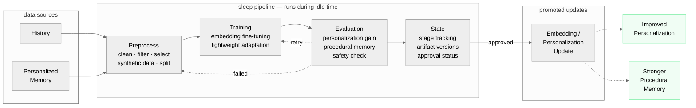

<p align="center">
  
</p>

# localmelo

[English](./README.md) | [简体中文](./README.zh-CN.md)

`localmelo` is a local-first agent runtime focused on explicit memory layers,
tool use, and a future sleep-time personalization workflow. The core connects to
configured local backends and cloud backends via their endpoints — it does not
host or manage local runtimes itself.

The project is being built in public. The architecture is in place, the codebase
is being organized, and core interfaces are being stabilized, but the full
product vision is not implemented yet.

**[Updates & Changelog](https://localmelo.github.io/localmelo/updates.html)** | **[Architecture Diagram](https://localmelo.github.io/localmelo/architecture.html)**

## Status

**Pre-alpha / work in progress**

This repository should currently be read as:

- an evolving agent runtime
- a clean project structure for future development
- a foundation for local deployment, memory, and personalization experiments

It should **not** yet be treated as:

- a production-ready agent framework
- a stable public API
- a finished personalization or memory system

Expect breaking changes while the project is being shaped.

## Vision

The long-term goal of `localmelo` is to provide a local agent stack with:

- a core runtime separated from deployment and infrastructure concerns
- multiple memory layers with different responsibilities
- explicit support for local model backends
- a sleep-time pipeline for future personalization and offline consolidation

The intended model is:

- `working memory` for active session context
- `long memory` for slower, selective retrieval
- `history` for append-only records
- `personalized memory` for future training signals
- `sleep mode` for preprocessing, training, evaluation, and state tracking

## Current Scope

What exists today:

- a split architecture between `melo/` and `support/`
- agent, memory, checker, and executor modules
- provider contracts and OpenAI-compatible provider implementations
- backend adapter registry with local and cloud vendor backends
- gateway infrastructure
- persistent config and onboarding helpers
- scaffolding for sleep-time preprocessing, training, evaluation, and state
- test coverage around the current architecture and integration points

What is intentionally still incomplete:

- a complete end-to-end sleep mode workflow
- a finished personalization training pipeline
- stable long-memory promotion and retrieval policies
- production-grade developer documentation and examples
- finalized external APIs

## Architecture

> **Design rule:** `melo/` is the core agent layer. `support/` is the infrastructure
> layer. `melo/` never depends on `support/` implementations directly.

```text
localmelo/
  melo/       # core runtime: agent, memory, checker, executor, sleep
  support/    # infrastructure: backends, providers, gateway, config
  tests/      # regression and integration tests
```

---

**[Interactive Architecture Diagram](https://localmelo.github.io/localmelo/architecture.html)** — click components, highlight connections, detail panels

<details>
<summary><b>Agent / Planner</b> — main loop, chat planning, orchestration</summary>

<br>

The agent runs a multi-stage loop per task:

1. **Retrieval** — fetch long-term context via embedding search + short-term window
2. **Tool Resolution** — extract tool hints from messages, resolve via BM25 + exact lookup
3. **Planning** — LLM generates a thought and optional tool call
4. **Execution** — executor runs the tool with timeout and workspace policy
5. **Memorization** — store step in history, memorize to short + long memory

The checker validates boundaries at stages 2–5. If any check fails, the agent replans.

Key files: `melo/agent/agent.py` · `melo/agent/chat.py`

</details>

<details>
<summary><b>Memory</b> — short · long · history · personalized · tools</summary>

<br>

Four-layer memory architecture coordinated by **Hippo**:

| Layer | Purpose | Backend |
|---|---|---|
| **Short-term** | Fixed-size rolling window (default 20) | In-memory deque |
| **Long-term** | Embedding-based semantic search | SQLite (optional) |
| **History** | Append-only task / step records | SQLite (optional) |
| **Tool Registry** | BM25 semantic index + exact name lookup | In-memory |

The coordinator provides: `retrieve_context()`, `resolve_tools()`, `memorize()`, `store_step()`.

Key files: `melo/memory/coordinator.py` · `melo/memory/long/sqlite.py` · `melo/memory/history/sqlite.py`

</details>

<details>
<summary><b>Executor</b> — tools, builtins, workspace policy</summary>

<br>

Structured execution pipeline:

1. Registry lookup (authoritative tool definition)
2. Pre-execute check (checker boundary)
3. Callable resolution
4. Workspace policy enforcement (file path restrictions)
5. Timeout + exception handling (60s default)
6. Artifact collection (metadata about created / read files)

Returns `ExecutionOutcome` with: status, error category, duration, artifacts.

Key files: `melo/executor/executor.py` · `melo/executor/builtins.py` · `melo/executor/policy.py`

</details>

<details>
<summary><b>Checker</b> — validation guard across all boundaries</summary>

<br>

Multi-boundary validation at every stage:

| Boundary | What it checks |
|---|---|
| **Gateway → Agent** | Request validation, ingress safety |
| **Agent → Memory** | Memory write size limits |
| **Agent → Executor** | Blocked commands (`rm -rf`, `mkfs`, fork bombs) |
| **Executor → Agent** | Output truncation (50 KB limit) |
| **Agent planning** | Prompt size, tool name validation |

When any check fails, a `CheckResult(allowed=False, reason=...)` is returned and the agent replans.

Key files: `melo/checker/checker.py` · `melo/checker/validators.py` · `melo/checker/payloads.py`

</details>

<details>
<summary><b>Sleep</b> — offline personalization pipeline</summary>

<br>

Designed for continuous fine-tuning of the agent's embedding and personalization
stack during idle time.

**Purpose:**
- Improve personalization over time
- Strengthen procedural memory
- Not part of the online request path

**Stages:** preprocess → training → evaluation → state → promotion

See the [Sleep Module diagram](#localmelo-sleep-module) below for the full workflow.

Key files: `melo/sleep/preprocess/` · `melo/sleep/training/` · `melo/sleep/evaluation/` · `melo/sleep/state/`

</details>

<details>
<summary><b>Support / Infrastructure</b> — backends, providers, gateway, config</summary>

<br>

| Module | Role |
|---|---|
| `backends/` | Backend adapter registry and implementations (local + cloud) |
| `providers/` | Concrete LLM and embedding implementations (OpenAI-compatible) |
| `gateway/` | HTTP gateway, session management, webapp |
| `config.py` | Persistent TOML config at `~/.cache/localmelo/config.toml` |
| `onboard.py` | Setup wizard and onboarding flow |

**Supported backends:**

| Backend | Type | Description |
|---|---|---|
| `ollama` | local | Ollama-compatible server |
| `mlc` | local | MLC-LLM server |
| `vllm` | local | vLLM server |
| `sglang` | local | SGLang server |
| `openai` | cloud | OpenAI API |
| `gemini` | cloud | Google Gemini API |
| `anthropic` | cloud | Anthropic API |
| `nvidia` | cloud | NVIDIA API |

Local backends run as external processes managed by the user; localmelo connects
to them via a configured URL. Cloud backends connect to vendor APIs directly.

Backend-specific logic (validation, provider construction) lives in
`support/backends/`. The app layer dispatches via a registry -- no hardcoded backend branching.

> **Future:** a separate repository for local backend deployment and runtime
> management is being considered, but it is not part of localmelo core yet.

</details>

---

### localmelo Sleep Module

> *offline / idle time — not in the online request path*



> The sleep module is intended for **continuous embedding and personalization
> fine-tuning** during user idle periods. Its purpose is to improve
> personalization and strengthen procedural memory over time, without affecting
> the online agent loop.

<details>
<summary><b>Sleep stages explained</b></summary>

<br>

| Stage | What happens |
|---|---|
| **Preprocess** | Data cleaning, filtering, sample selection, synthetic data generation, train/eval split |
| **Training** | Continuous embedding fine-tuning, lightweight adaptation, personalization updates |
| **Evaluation** | Measure personalization gain, procedural memory improvement, check for safety/quality regression |
| **State** | Track current sleep stage, artifact versions, evaluation status, approved/rejected decisions |
| **Promotion** | Only approved updates are promoted back into the agent system |

On evaluation failure, the pipeline feeds back to preprocess or training for retry.
Rejected updates are never promoted.

</details>

---

## Getting Started

### Requirements

- Python 3.11+

### Install

```bash
pip install -e ".[dev,gateway]"
```

### Run

Direct mode:

```bash
melo "hello"
```

Gateway mode:

```bash
melo --serve
```

### Test

```bash
pytest
```

### Verify

After install + `melo --reconfigure`, run the
**[Minimum smoke](docs/quickstart.md#minimum-smoke)** section in the
quickstart to confirm direct CLI mode, gateway mode, session reuse, and
your chosen backend each work end-to-end.

## Development Notes

The project is currently architecture-first.

That means the priority right now is:

- cleaning boundaries between runtime and infrastructure
- stabilizing contracts and internal data flow
- building the memory and sleep-mode foundations
- improving test coverage before feature expansion

If you are reading this early, the repository may look "more organized than
feature-complete" on purpose.

## Roadmap

Near-term:

- finish the first usable local agent loop
- expand memory-layer behavior beyond scaffolding
- wire sleep-mode preprocessing into actual runtime flows
- improve backend configuration UX

Mid-term:

- add real sleep-time dataset preparation
- add adapter-based personalization experiments
- define a clearer long-memory retrieval and promotion policy
- add examples and documentation for backend configuration

Long-term:

- support stable local-first agent workflows
- support explicit memory consolidation
- support optional user-specific personalization during offline periods
- explore a separate local backend deployment / runtime management layer

## Updates

See the full **[Updates & Changelog](https://localmelo.github.io/localmelo/updates.html)** for detailed progress on each development track, with English/Chinese toggle.

Until the project reaches a more stable phase, updates will be incremental,
architecture-heavy, and sometimes breaking.

## Contributing

Contributions, issues, and feedback are welcome, but please keep in mind:

- the project is still changing quickly
- some modules are scaffolding for future work
- naming, APIs, and boundaries may still move

If you open a PR, smaller and focused changes will be easier to review than
large feature drops.

## Project Maturity

If you are evaluating `localmelo` today, the best description is:

**a serious early-stage codebase with clear direction, but not a finished agent
framework yet.**
