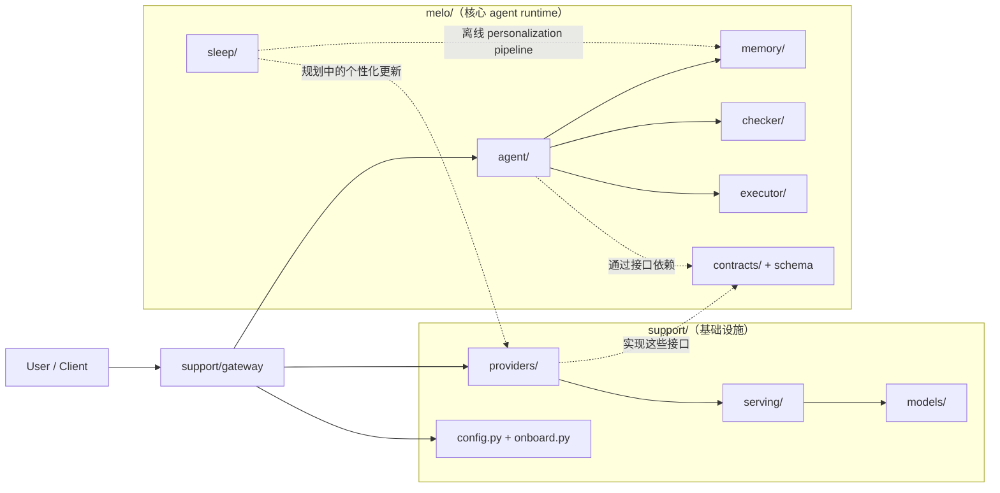
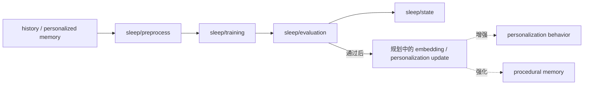

# localmelo

[English](./README.md) | [简体中文](./README.zh-CN.md)

`localmelo` 是一个本地优先的 agent runtime，关注显式 memory 分层、tool use，以及未来的 sleep-time personalization workflow。

这个项目正在公开迭代中。当前已经完成了整体架构搭建、代码分层和核心接口整理，但完整的产品能力还没有实现。

## 当前状态

**Pre-alpha / 持续开发中**

目前这个仓库更适合被理解为：

- 一个正在演进的 agent runtime
- 一个为后续功能扩展准备好的清晰项目结构
- 一个用于本地部署、memory 和 personalization 实验的基础框架

它目前还**不应该**被理解为：

- 可直接投入生产的 agent framework
- 稳定的公共 API
- 已经完成的 personalization 或 memory system

在项目继续推进的过程中，breaking changes 是预期内的。

## 项目目标

`localmelo` 的长期目标是提供一套本地 agent stack，具备：

- 与部署和基础设施解耦的核心 runtime
- 多层 memory 结构，不同层负责不同职责
- 对本地 model backend 的显式支持
- 用于离线整理和未来个性化训练的 sleep-time pipeline

当前设想中的 memory model 包括：

- `working memory`：当前 session 的活跃上下文
- `long memory`：低频、选择性检索的长期信息
- `history`：append-only 的交互记录
- `personalized memory`：未来训练信号的候选池
- `sleep mode`：用于 preprocess、training、evaluation 和 state tracking

## 当前范围

目前已经存在的部分：

- `melo/` 与 `support/` 的明确分层
- agent、memory、checker、executor 模块
- provider contracts 与 OpenAI-compatible provider 实现
- gateway 与 serving 基础设施
- 持久化 config 与本地 serving 辅助能力
- sleep-time preprocess、training、evaluation、state 的骨架
- 覆盖当前架构和主要集成路径的测试

目前仍然明确未完成的部分：

- 完整的 end-to-end sleep mode workflow
- 完成版的 personalization training pipeline
- 稳定的 long-memory promotion / retrieval 策略
- 面向使用者的完整文档和示例
- 最终稳定的外部 API

## 架构

仓库目前围绕“runtime / infrastructure 分离”来组织：

```text
localmelo/
  melo/       # 核心 runtime：agent, memory, checker, executor, sleep
  support/    # 基础设施：providers, gateway, serving, config, models
  tests/      # 回归测试与集成测试
```

核心设计原则：

- `melo/` 是主要的 agent 层
- `support/` 是支撑 agent 运行的基础设施层
- `melo/` 不应直接依赖 `support/` 的具体实现

### 高层架构图



### 结构说明

#### `melo/`

`melo/` 是项目里最核心的 agent runtime。

目前其中各部分职责大致如下：

- `agent/`：主 agent loop、chat planning，以及高层调度逻辑
- `memory/`：负责 working memory、long memory、history、tool memory，以及未来 personalized memory 的协调
- `checker/`：负责 planning、execution、gateway ingress、memory write 等边界上的校验与约束
- `executor/`：负责 tool execution、内置工具、执行结果模型以及 workspace policy
- `sleep/`：负责用户空闲时的离线 personalization pipeline，包括 preprocess、training、evaluation 和 state tracking
- `contracts/`：放共享接口定义，例如 provider contracts
- `schema.py`：放共享的数据结构和核心类型

#### `support/`

`support/` 不是 agent 本身，而是支撑 agent 运行的外围基础设施。

目前主要包括：

- `providers/`：具体的 LLM / embedding provider 实现
- `gateway/`：session 管理、HTTP gateway 和 webapp 接线
- `serving/`：本地模型 serving 辅助能力和 serving 配置
- `models/`：本地模型注册、编译辅助和编译产物路径管理
- `config.py`：持久化运行配置
- `onboard.py`：初始化和 onboarding 流程
- `3rdparty/`：support 层依赖的第三方组件

### Sleep Module 流程图



## 快速开始

### 环境要求

- Python 3.11+

### 安装

```bash
pip install -e ".[dev,gateway]"
```

### 运行

直接模式：

```bash
melo "hello"
```

Gateway 模式：

```bash
melo --serve
```

### 测试

```bash
pytest
```

## 开发说明

这个项目当前是一个 **architecture-first** 的仓库。

也就是说，当前阶段的重点是：

- 清理 runtime 和 infrastructure 的边界
- 稳定 contracts 和内部数据流
- 搭建 memory 与 sleep-mode 的基础能力
- 在继续扩展功能之前先补齐测试覆盖

所以你现在看到的仓库，可能会表现为“结构已经很清晰，但功能还没有完全长出来”。这是有意为之。

## Roadmap

近期：

- 完成第一版可用的本地 agent loop
- 让 memory layer 超越当前骨架实现
- 将 sleep-mode preprocess 真正接入 runtime 流程
- 改善本地 serving 和 backend 配置体验

中期：

- 增加真实的 sleep-time dataset preparation
- 增加基于 adapter 的 personalization 实验
- 明确 long-memory 的 retrieval / promotion 策略
- 增加本地部署示例和文档

长期：

- 支持稳定的 local-first agent workflows
- 支持显式 memory consolidation
- 支持用户离线时的可选 personalization

## 更新记录

这个区块的作用是：在项目仍处于快速演进阶段时，让仓库首页就能清楚反映进展。

### 最新更新

- runtime 与 infrastructure 已拆分为 `melo/` 和 `support/`
- 引入了 provider contracts 以降低模块耦合
- 明确了 memory 和 sleep-mode 的包边界
- 新增了 `sleep` module，作为持续性 personalization 的基础模块；它的长期目标是在用户空闲时逐步微调 agent 的 embedding / personalization stack，从而增强个性化能力和程序性记忆
- 清理并统一了本地 serving 路径
- 改善了 CLI 与 gateway 的接线方式
- 扩展了回归测试覆盖

### 更新策略

在项目进入更稳定阶段之前，更新会更偏向：

- 增量式推进
- 架构整理优先
- 可能包含 breaking changes
- 先记录在 README，再逐步拆分到更正式的文档中

## 贡献

欢迎提交 issue、反馈和 PR，但需要注意：

- 项目目前还在快速变化
- 一些模块仍然只是为后续功能预留的骨架
- 命名、API 和模块边界仍可能继续调整

如果要提 PR，优先推荐小而清晰、边界明确的改动，而不是一次性的大规模功能堆叠。

## 项目成熟度

如果你现在要对 `localmelo` 做一句判断，最准确的描述是：

**这是一个方向明确、结构严肃的早期代码库，但它还不是一个已经完成的 agent framework。**
