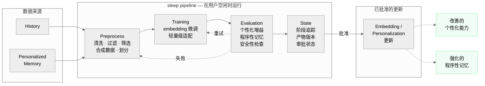

<p align="center">
  
</p>

# localmelo

[English](./README.md) | [简体中文](./README.zh-CN.md)

`localmelo` 是一个本地优先的 agent runtime，关注显式 memory 分层、tool use，以及未来的 sleep-time personalization workflow。

这个项目正在公开迭代中。当前已经完成了整体架构搭建、代码分层和核心接口整理，但完整的产品能力还没有实现。

## 当前状态

**Pre-alpha / 持续开发中**

目前这个仓库更适合被理解为：

- 一个正在演进的 agent runtime
- 一个为后续功能扩展准备好的清晰项目结构
- 一个用于本地部署、memory 和 personalization 实验的基础框架

它目前还**不应该**被理解为：

- 可直接投入生产的 agent framework
- 稳定的公共 API
- 已经完成的 personalization 或 memory system

在项目继续推进的过程中，breaking changes 是预期内的。

## 项目目标

`localmelo` 的长期目标是提供一套本地 agent stack，具备：

- 与部署和基础设施解耦的核心 runtime
- 多层 memory 结构，不同层负责不同职责
- 对本地 model backend 的显式支持
- 用于离线整理和未来个性化训练的 sleep-time pipeline

当前设想中的 memory model 包括：

- `working memory`：当前 session 的活跃上下文
- `long memory`：低频、选择性检索的长期信息
- `history`：append-only 的交互记录
- `personalized memory`：未来训练信号的候选池
- `sleep mode`：用于 preprocess、training、evaluation 和 state tracking

## 当前范围

目前已经存在的部分：

- `melo/` 与 `support/` 的明确分层
- agent、memory、checker、executor 模块
- provider contracts 与 OpenAI-compatible provider 实现
- gateway 与 serving 基础设施
- 持久化 config 与本地 serving 辅助能力
- sleep-time preprocess、training、evaluation、state 的骨架
- 覆盖当前架构和主要集成路径的测试

目前仍然明确未完成的部分：

- 完整的 end-to-end sleep mode workflow
- 完成版的 personalization training pipeline
- 稳定的 long-memory promotion / retrieval 策略
- 面向使用者的完整文档和示例
- 最终稳定的外部 API

## 架构

> **核心设计原则：** `melo/` 是主要的 agent 层。`support/` 是支撑 agent 运行的
> 基础设施层。`melo/` 不应直接依赖 `support/` 的具体实现。

```text
localmelo/
  melo/       # 核心 runtime：agent, memory, checker, executor, sleep
  support/    # 基础设施：providers, gateway, serving, config, models
  tests/      # 回归测试与集成测试
```

---

**[交互式架构图](https://localmelo.github.io/localmelo/architecture.html)** — 点击组件查看详情，高亮关联连接

<details>
<summary><b>Agent / Planner</b> — 主循环、chat planning、调度</summary>

<br>

Agent 对每个 task 执行多阶段循环：

1. **Retrieval** — 通过 embedding 搜索获取长期上下文 + 短期窗口
2. **Tool Resolution** — 从消息中提取 tool hints，通过 BM25 + 精确查找解析
3. **Planning** — LLM 生成 thought 和可选的 tool call
4. **Execution** — executor 执行 tool，带超时和 workspace policy
5. **Memorization** — 在 history 中记录步骤，向 short + long memory 写入

Checker 在第 2–5 阶段验证边界。任何检查失败都会触发 agent 重新规划。

核心文件：`melo/agent/agent.py` · `melo/agent/chat.py`

</details>

<details>
<summary><b>Memory</b> — short · long · history · personalized · tools</summary>

<br>

由 **Hippo** 协调的四层 memory 架构：

| 层 | 职责 | 后端 |
|---|---|---|
| **Short-term** | 固定大小的滚动窗口（默认 20） | 内存 deque |
| **Long-term** | 基于 embedding 的语义搜索 | SQLite（可选） |
| **History** | Append-only 的 task / step 记录 | SQLite（可选） |
| **Tool Registry** | BM25 语义索引 + 精确名称查找 | 内存 |

协调器提供：`retrieve_context()`、`resolve_tools()`、`memorize()`、`store_step()`。

核心文件：`melo/memory/coordinator.py` · `melo/memory/long/sqlite.py` · `melo/memory/history/sqlite.py`

</details>

<details>
<summary><b>Executor</b> — tools、builtins、workspace policy</summary>

<br>

结构化执行流程：

1. 注册表查找（权威 tool 定义）
2. 执行前检查（checker 边界）
3. Callable 解析
4. Workspace policy 强制执行（文件路径限制）
5. 超时 + 异常处理（默认 60s）
6. Artifact 收集（创建 / 读取文件的元数据）

返回 `ExecutionOutcome`，包含：status、error category、duration、artifacts。

核心文件：`melo/executor/executor.py` · `melo/executor/builtins.py` · `melo/executor/policy.py`

</details>

<details>
<summary><b>Checker</b> — 跨越所有边界的校验守卫</summary>

<br>

在每个阶段进行多边界校验：

| 边界 | 检查内容 |
|---|---|
| **Gateway → Agent** | 请求校验、ingress 安全 |
| **Agent → Memory** | Memory 写入大小限制 |
| **Agent → Executor** | 禁止危险命令（`rm -rf`、`mkfs`、fork bomb） |
| **Executor → Agent** | 输出截断（50 KB 限制） |
| **Agent planning** | Prompt 大小、tool 名称校验 |

当任何检查失败时，返回 `CheckResult(allowed=False, reason=...)`，agent 重新规划。

核心文件：`melo/checker/checker.py` · `melo/checker/validators.py` · `melo/checker/payloads.py`

</details>

<details>
<summary><b>Sleep</b> — 离线 personalization pipeline</summary>

<br>

设计用于在用户空闲时持续微调 agent 的 embedding 和 personalization stack。

**目的：**
- 逐步改善个性化能力
- 强化程序性记忆
- 不在在线请求路径中

**阶段：** preprocess → training → evaluation → state → promotion

完整的工作流请参见下方 [Sleep Module 流程图](#localmelo-sleep-module)。

核心文件：`melo/sleep/preprocess/` · `melo/sleep/training/` · `melo/sleep/evaluation/` · `melo/sleep/state/`

</details>

<details>
<summary><b>Support / 基础设施</b> — providers、gateway、serving、config</summary>

<br>

| 模块 | 职责 |
|---|---|
| `providers/` | 具体的 LLM / embedding provider 实现（OpenAI-compatible） |
| `gateway/` | HTTP gateway、session 管理、webapp |
| `serving/` | 本地模型 serving 辅助能力 |
| `models/` | 模型注册、编译辅助、编译产物路径管理 |
| `config.py` | 持久化 TOML 配置，位于 `~/.cache/localmelo/config.toml` |
| `onboard.py` | 初始化和 onboarding 流程 |

支持三种 backend：`mlc-llm` · `ollama` · `online`（OpenAI / Gemini / Anthropic）

</details>

---

### localmelo Sleep Module

> *离线 / 用户空闲时运行 — 不在在线请求路径中*



> Sleep 模块用于在用户空闲时进行 **持续性 embedding 和 personalization 微调**。
> 目的是逐步改善个性化能力、强化程序性记忆，同时不影响在线 agent loop。

<details>
<summary><b>Sleep 各阶段说明</b></summary>

<br>

| 阶段 | 内容 |
|---|---|
| **Preprocess** | 数据清洗、过滤、样本筛选、合成数据生成、train/eval 划分 |
| **Training** | 持续性 embedding 微调、轻量级适配、个性化更新 |
| **Evaluation** | 衡量个性化增益、程序性记忆改善、检查安全/质量回归 |
| **State** | 追踪当前 sleep 阶段、产物版本、evaluation 状态、approved/rejected 记录 |
| **Promotion** | 只有通过审批的更新才会被推送回系统 |

评估失败时，pipeline 会回退到 preprocess 或 training 进行重试。
被拒绝的更新永远不会被推送。

</details>

---

## 快速开始

### 环境要求

- Python 3.11+

### 安装

```bash
pip install -e ".[dev,gateway]"
```

### 运行

直接模式：

```bash
melo "hello"
```

Gateway 模式：

```bash
melo --serve
```

### 测试

```bash
pytest
```

## 开发说明

这个项目当前是一个 **architecture-first** 的仓库。

也就是说，当前阶段的重点是：

- 清理 runtime 和 infrastructure 的边界
- 稳定 contracts 和内部数据流
- 搭建 memory 与 sleep-mode 的基础能力
- 在继续扩展功能之前先补齐测试覆盖

所以你现在看到的仓库，可能会表现为"结构已经很清晰，但功能还没有完全长出来"。这是有意为之。

## Roadmap

近期：

- 完成第一版可用的本地 agent loop
- 让 memory layer 超越当前骨架实现
- 将 sleep-mode preprocess 真正接入 runtime 流程
- 改善本地 serving 和 backend 配置体验

中期：

- 增加真实的 sleep-time dataset preparation
- 增加基于 adapter 的 personalization 实验
- 明确 long-memory 的 retrieval / promotion 策略
- 增加本地部署示例和文档

长期：

- 支持稳定的 local-first agent workflows
- 支持显式 memory consolidation
- 支持用户离线时的可选 personalization

## 更新记录

这个区块的作用是：在项目仍处于快速演进阶段时，让仓库首页就能清楚反映进展。

### 最新更新

- runtime 与 infrastructure 已拆分为 `melo/` 和 `support/`
- 引入了 provider contracts 以降低模块耦合
- 明确了 memory 和 sleep-mode 的包边界
- 新增了 `sleep` module，作为持续性 personalization 的基础模块；它的长期目标是在用户空闲时逐步微调 agent 的 embedding / personalization stack，从而增强个性化能力和程序性记忆
- 清理并统一了本地 serving 路径
- 改善了 CLI 与 gateway 的接线方式
- 扩展了回归测试覆盖

### 更新策略

在项目进入更稳定阶段之前，更新会更偏向：

- 增量式推进
- 架构整理优先
- 可能包含 breaking changes
- 先记录在 README，再逐步拆分到更正式的文档中

## 贡献

欢迎提交 issue、反馈和 PR，但需要注意：

- 项目目前还在快速变化
- 一些模块仍然只是为后续功能预留的骨架
- 命名、API 和模块边界仍可能继续调整

如果要提 PR，优先推荐小而清晰、边界明确的改动，而不是一次性的大规模功能堆叠。

## 项目成熟度

如果你现在要对 `localmelo` 做一句判断，最准确的描述是：

**这是一个方向明确、结构严肃的早期代码库，但它还不是一个已经完成的 agent framework。**
